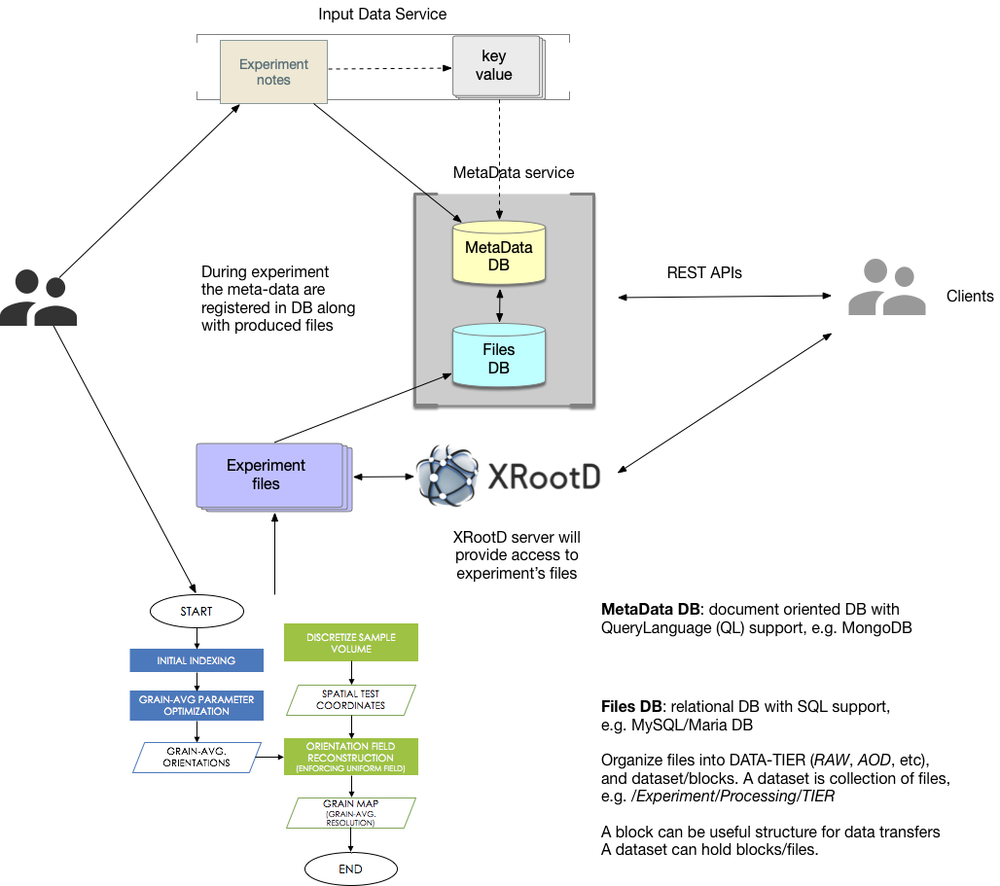

### Introduction
The CHESS data flow has been discussed in this
[document](https://paper.dropbox.com/doc/HEXRD-combined-far-field-and-near-field-data-flow--Af62eKuTFDYbcbx~6Ncl4YTWAg-V4SAqod7NW6BvV6kYyTy2).

Here we propose a possible architecture for CHESS data management
based on gradual enchancement of existing infrastructure:



In particular, we propose to introduce the following components:
- MetaData DB based on [MongoDB](https://www.mongodb.com) or similar
document-oriented database. Such solution should provide the following
features:
  - be able to handle free-structured text documents
  - provide reach QueryLanguage (QL)

- Files DB based on any relation database, e.g. [MySQL](https://www.mysql.com)
or free alternative [MariaDB](https://mariadb.com). The purpose of this
database is provide data bookkeeping capabilities and organize
meta-data in the following form:
  - a dataset is a collection of files (or blocks)
  - each dataset name may carry on an Experiment name and additional
  meta-data information
  - organize files in specific data-tiers, e.g. RAW for raw data,
  AOD for processed data, etc.
  - as such each dataset will have a form of a path:
    /Experiment/Processing/Tier

Both databases may reside in their own data-service called MetaData Service.
Such service can provide RESTful APIs for end-users, such as
- inject data to DBs
- fetch results
- update data in DBs
- delete data in DBs

In addition, we suggest to introduce Input Data Service which can
take care of standardization of user inputs, e.g. key-value pairs, tagging,
etc. It is not required originally, but will help in a long run to
provide uniform data representation for Meta Data Service.

Finally, the data access can be organized via XrootD service.

### Insert data into MetaData DB:
We provide a `chess_parser.py` script to parse input Microsoft Word documents,
extract and inject its content into MongoDB. Here is an example
of such operation
```
# prepare files.db (so far we use SqliteDB)
rm files.db; sqlite3 files.db < doc/schema.sql

# start MongoDB

# prepare parameter file which will contain DB, experiment parameters
# so far I choose JSON data-format, but it can be replaced with
# YAML data-format which is much more simpler and intuitive for end-users
cat doc/params.json
{
    "fname": "doc/miller-774-1_beamtime_notes.docx",
    "path": "files",
    "dburi": "mongodb://localhost:8230",
    "dbname": "chess",
    "dbcoll": "meta",
    "filesdb": "files.db",
    "experiment": "Titanium",
    "processing": "FirstPass",
    "tier": "RAW"
}

# inject data into MongoDB (MetaDataDB) and Sqlite (FilesDB)
./chess_parser.py --params=doc/params.json --verbose
```

### Find documents in MetaData DB
We provide basic implementation of finder script `chess_finder.py`
which should be able to find required meta-data in MongoDB
via provide free-text query:
```
# find meta-data information
./chess_finder.py --params=doc/params.json --query="scan 74-77"
# find corredponding files
./chess_finder.py --params=doc/params.json --query="scan 74-77" --list-files --verbose
```

Please note, to perform free text search queries we need to define
text index, e.g.
```
db.meta.createIndex( { description: "text" } )
```

### References

1. [MongoDB](https://www.mongodb.com)
2. [MySQL](https://www.mysql.com)
3. [MariaDB](https://mariadb.com)
4. [MongoDB free-text search](https://docs.mongodb.com/manual/text-search/)

